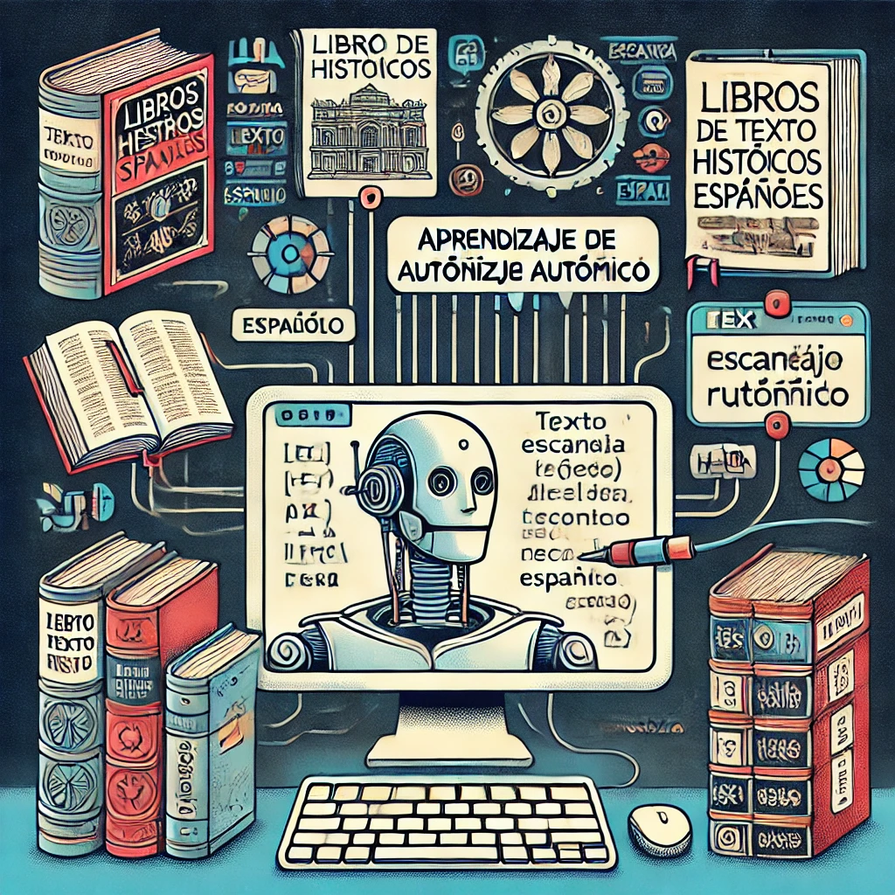

# RenAIssance: OCR for Seventeenth Century Spanish Texts
<!--  -->

## Description
RenAIssance encompasses the use of optical character recognition (OCR) necessary to digitize text sources that have not yet been targeted by existing tools. Its purpose is to find ways to apply machine learning techniques to make OCR possible on a variety of materials that have never been digitized before. This project focuses on applying AI to recognize text in Spanish printed sources from the seventeenth century, an area underserved by current OCR tools.

Transliteration of text from centuries-old works represents a research area that is underserved by current tools, such as Adobe Acrobat’s OCR. While these resources can perform text recognition from clearly printed modern sources, they are incapable of extracting textual data from early forms of print, much less manuscripts.

## Task
Build a model based on convolutional-recurrent architectures for optically recognizing the text in the given image dataset. Pick the most appropriate approach and discuss your strategy.

## Dataset
- A collection of various printed texts from the seventeenth century.

## Evaluation Metrics
Discuss which evaluation metrics you are using to evaluate your model performance. Consider the following metrics:
- Character Error Rate (CER)
- Word Error Rate (WER)
- Precision, Recall, and F1 Score for recognized text

## Deliverables
- A trained OCR model capable of recognizing text in the provided datasets.
- A brief report discussing the chosen approach, model architecture, training process, and evaluation results.
- Example usage notebook demonstrating the model's performance on sample data.

## Example Notebook

## Contributors

- Shashank Shekhar Singh (Indian Institue of Technology, BHU)
- Utsav Rai (Imperial College London)
- Yukinori Yamamoto (Waseda University)
- Arsh Khan (VJTI, Mumbai)
- Xabier Granja (University of Alabama)
- Sergei Gleyzer (University of Alabama)
- Harrison Meadows (University of Tennessee)
 