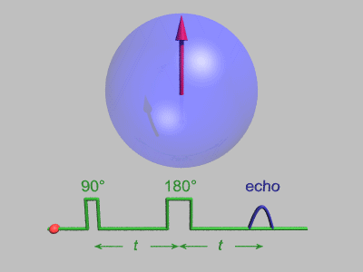
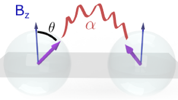
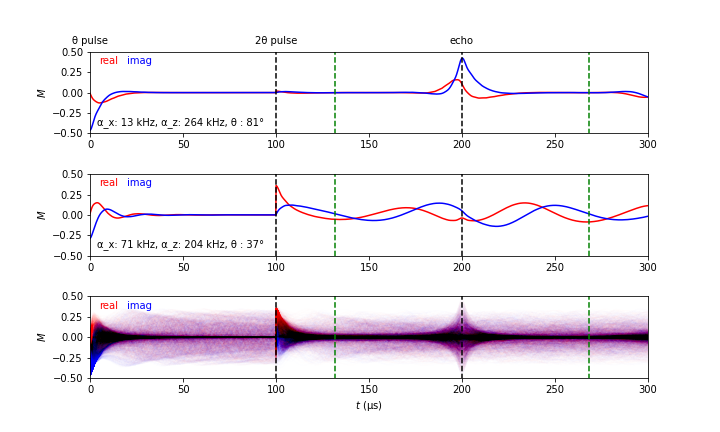

# Hackathon - NMR Challenge

### Problem Statement

- Nuclear Magnetic Resonance (NMR) is an experimental technique that allows for the control and measurement of nuclear spins in crystals and molecules.
- A common "recipe" for NMR is called the spin echo: the spins start aligned, begin to disperse, and are then refocused. This creates a sharp peak, or "echo", in the net magnetization M of the material at a later time. When the spins interact with each other, this refocused echo can become highly distorted.
- Materials with strong electron-electron couplings have a variety of applications, from superconductivity to ferromagnetism. They also tend to enhance the nuclear spin-spin couplings, allowing NMR to act as a probe of these important systems.
- Design and train a model that predicts the strength and shape of interactions between the nuclear spins from simulated time-dependent magnetization curves, M(t).

Before getting to any code, we first review the structure of this machine learning problem and introduce some of the details of the underlying physics we are trying to capture.

## Quick description of the ML problem

### Goal:
Predict three numbers from a large input vector of real numbers.

### Example Solution:  Multilayer Neural Network and Decision Trees (see code after this introduction)

To get the complex-valued time-series M(t) into a neural network, we can simply "stack" the real and complex parts together to make a real-valued input vector.

## Deliverables:

We ask you to submit two models: one for guass and one for rkky. We ask you to make your predictions on the test sets. You don't have the true labels for the test sets meaning you are limited only to what you know about train sets (and validation subsets) to build the best models possible. 

Use your models to predict the three spin-interaction variables from the  echos, and submit your results for **each model** (two models total) in a tab delimited .txt  file of dimensions 6000 x 3 matching the "<model_type>_mat_info_model.txt" format.

That is, the columns should be:
| $\\alpha$ | $\\xi$ | $d$ |
and there should be 6000 rows.

Name this file "<model_type>_mat_info_eval.txt". 
The quality of the model will be judged by the minimization of normalized   mean-square error: 
$\\textrm{Err} = \\sum_{v=1}^{3} \\sum_{i=i}^{6000} \\left( \\tilde{v}^i_\\textrm{model} - \\tilde{v}^i_\\textrm{true} \\right)^2 $\n",

where $v^i$ is one of the three spin-interaction variables for echo number $i$,  , and the tilde represents normalization of each variable (using the StandardScaler() object used above). Your submission should include: 
- Your ipython notebook (`.ipynb`),
- A PDF copy of your notebook together with a description of what you have done
- Your model's evaluation of the Gaussian data (\"gauss_mat_info_eval.txt\")
- Your model's evaluation of the RKKY data (\"RKKY_mat_info_eval.txt\").\n",

**NOTE: If your final model prediction files aren't named \"gauss_mat_info_eval.txt\" and \"RKKY_mat_info_eval.txt\" your results might not be correctly evaluated by the automatic evaluation software.**

## Introduction to NMR and spin echos

Although the NMR "spin echo" technique may sound complicated, the following animation created by Gavin W Morley (by way of https://en.wikipedia.org/wiki/Spin_echo) makes it much clearer!

The red arrows in this animation represents the values of nuclear spins in the material.
They all begin in the same direction (up), and then an applied magnetic field rotates them into the x-y plane (indicated by the 90° pulse).
A constant external magnetic field in the z-direction did not affect the spins when they were pointing "up", but now that they lie in the x-y plane they begin to precess.

Because each nuclear spin sits in a slightly different magnetic environment, each one has a slightly different response to the background z-direction magnetic field, causing some to precess in a clockwise direction and others in a counterclockwise direction.

After a fixed amount of time, t in the above animation, a second magnetic pulse is applied and rotates each spin 180° in the x-y plane.
After this, the spins continue to move as they did before, but because of the 180° pulse they are now effectively precessing  "backwards" compared to the original motion!
So after an additional time t passes, the variations in precession time is canceled out, causing a refocusing of the spins.

This shows up as a measurable "echo" in the average spin magnetization of the material, and can be measured in experiments.
This is an important technique because the average spin magnetization is hard to measure during an applied "pulse", but there is no external pulse during the "echo", allowing for accurate measurement of the peak value and decay shape.

In the following, we will use simulated data that studies how the magnetization depends on the interaction between spins, α, and the effective flip angle for the first pulse, θ.
In spin echo experiments, one tries to apply a θ = 90° pulse as in the above example, but in practice it is a hard thing to do!
Therefore, we will consider cases where the spins are not always exactly inplane after the first pulse (θ different than 90°).
For example, the following diagram shows a pulse angle of θ = 40°.

Here are examples of the time-dependent in-plane magnetization M(t) = M_x(t) + i M_y(t) for a spin-echo materials (M_x in red, M_y in blue):

The first example is a fairly standard spin echo: the average magnetization decays quite fast after the first θ = 90° pulse, and re-appears an equal time after the 2θ = 180° pulse as an "echo"!

The second more complicated example have been caused by spin-spin interactions between the precessing nuclear spins and a flip-angle θ not near 90°. Normally, each spin precesses in a uniform way irrespective of the rest of the nuclei in the material. In this coupled case, however, the nuclear magnetization that occurs near the "echo" influences the spins' motions, modifying the shape of the observed echo.

The final case shows all 3,000 M(t) curves from the simualtion dataset we will be using. Since most experiments do not have access to low-noise data near the θ and 2θ pulse times, we will only be using the region given within the green lines, t in the range [130,270] microseconds.

## Electronic and nuclear spins

Most materials can be classified by their electronic properties into three categories: metal, insulator, and semiconductor.
These terms are based on a semi-classical description of the electrons in a crystal.
The electrons are treated as a collection of classical particles, with energies that depend on their momentum in a way determined by the atomic structure of the crystal.

However, there are other electronic phases of matter that are truly "quantum" and cannot be described accurately with a classical analogy.
In these scenarios, complicated structures in the electron states can give rise to large electronic spin density or strong electron-electron coupling.
Because of these strong couplings between electrons, they are often hard to probe experimentally.

Luckily, electrons can interact with the nuclear spins of a material (by way of the hyperfine-interaction).
If the electron-nuclear coupling becomes strong enough (mediated perhaps by a strongly correlated electronic phase), then the nuclear spins will couple throughout the material.
This can be viewed as a two-step process, where a nuclear spin couples to an electron and changes its motion, and then that electron later "scatters" off another nuclear spin elsewhere in the material.

We here make the simplifying assumption that this scattering effect is determined by only three variables:

α_x: The effective scattering strength for nuclear spins when the spin-axis is perpindicular to the z-direction (perpindicular to the constant magnetic field). Note that we call this a_x but it defines the coupling in the entire xy plane.

α_z: The effective scattering strength for nuclear spins when the spin-axis is along the z-direction (parallel to the constant magnetic field)

θ: The "flip angle" of the nuclear spins caused by the strength of the applied pulse at t=0 and t=τ. In an ideal spin-echo experiment, θ = 90°, but in practice the exact flip-angle is never known.

Here we provide simulated spin-echo magnetizations M(t) from random samples of these three parameters to see if the spin-echo experiment can provide enough information to accurately "reverse engineer" them from a single M(t) curve.

In the simulated data-sets, the parameters are randomly distributed over the following ranges:
- α_x: coupling strength, with range [0, 100] kHz
- α_z: coupling strength, with range [0, 300] kHz
- θ: flip angle, with range [10°, 90°]

Our goal is to develop a model that accurately determines the above three variables from a single M(t) curve.

For more detail on the coupled spil model and details of the simulations, see the recent preprint: https://arxiv.org/abs/2110.06811

## Contributors

- Stephen Carr (Brown Theoretical Physics Center)
- Charles Snider (Brown University)
- J. B. Marston (Brown Theoretical Physics Center)
- V. F. Mitrović (Brown University)
- D. E. Feldman (Brown Theoretical Physics Center)
- C. Ramanathan (Dartmouth College)
- Eric Reinhardt (The University of Alabama)
