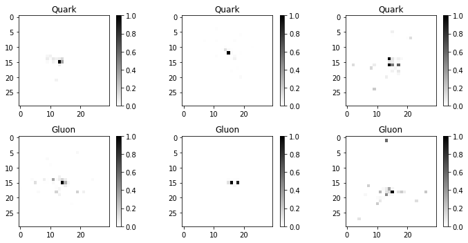

# QML Challenge

  
  

The goal of the challenge is to use a quantum machine learning model to perform anomaly detection on a particle physics dataset.
The idea is to train a model on background data only. Afterwards, we want to use the model to separate signal and background events in a test dataset.

## Dataset

We provide simulated detector images of quark and gluon jets for the dataset. To reduce the computational burden, we reduced the images to the size `30x30`. The dataset can be obtained [here](https://drive.google.com/file/d/1dJiFRqMWhBzT6lS7neGrIBYEiYX8oveT/view?usp=sharing).

The images show jets which originate from a Quark or Gluons. The Quark-initiated jets are labelled as $1$, while the Gluon-initiated jets are labelled as $0$. We want to train on the Quark-initiated jets and then tag the gluon jets.

Some example samples are shown below:

  

The top row shows the quark-initiated jets, while the bottom row shows gluon-initiated jets.

## Model

You are free to choose any model you like. However, in the spirit of quantum machine learning, we put a limit on the maximum number of parameters you are allowed to use.

## Challenge and Evaluation

We evaluate the challenge on the AUC of a black box test set. To be considered for the challenge, a solution needs to satisfy the following criteria:

1. The model is trained only on Quark jets (label 1)
2. The model has a maximum of xxx parameters
3. The solution is submitted as an executable notebook where which can be run without any additional third party libraries.

## Example notebook

We provide an example notebook which shows how to load the dataset and evaluate the performance of an anomaly detection model:

In the example, we train a __classical__ autoencoder.

image courtesy: [tensorflow](https://blog.tensorflow.org/2020/03/announcing-tensorflow-quantum-open.html), [prefetch](https://prefetch.eu/know/concept/bloch-sphere/).
